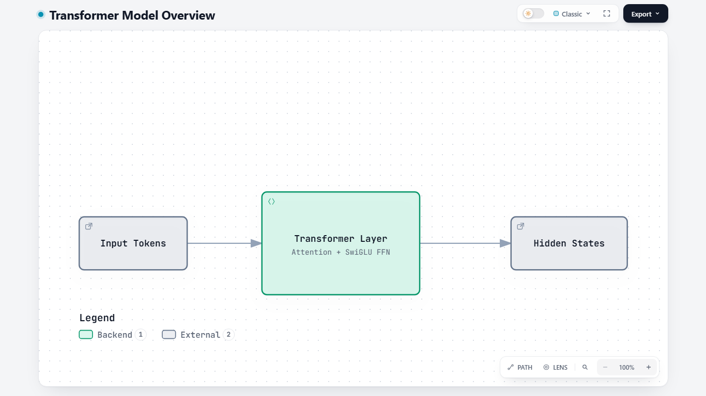
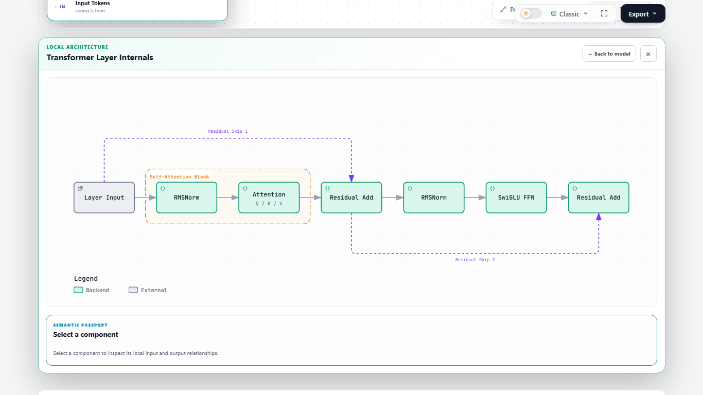

# Subarchitecture refresh evidence

Comparison base: `2afbf454d3d8c61e8a90b8eaf3d5fe27af67dc40` (`dev`). The candidate is the merged source accompanying these artifacts. Scope follows the [maintainer's requests](https://github.com/tt-a1i/archify/pull/269): bounded component internals, laptop readability, return navigation, independent child exports, and preserved parent behavior.

The trial destination is [the fork Labs branch](https://github.com/Puuuuup/archify/tree/labs/subarchitecture). PR #269 targets [the upstream Labs branch](https://github.com/tt-a1i/archify/tree/labs/subarchitecture). Upstream integration and a later mainline decision remain with the maintainers.

## Try the interactive example

Open [the online Transformer example](https://puuuuup.github.io/archify/gallery/artifacts/transformer-layer.architecture.html), or download [the self-contained artifact](../gallery/artifacts/transformer-layer.architecture.html) and open it locally in Chrome. Its [typed source](../../archify/examples/transformer-layer.architecture.json) is included.

1. Select **Transformer Layer** in the main graph and open its internals from Semantic Passport.
2. Inspect a child component; use **Back to model**, Close, or Escape to return.
3. Open the child again. In Export, select **Current subarchitecture**, then export SVG or PNG. The file contains only the child graph.
4. Select **Main architecture** in the same menu to export the parent graph separately. This remains the default target.

## Visual evidence

Screenshots use light theme, Classic preset, device scale 1, and still motion. The child expands below the main graph in the same page, as in the original PR. Opening it scrolls to the section. The graph keeps its natural aspect ratio, and Semantic Passport sits below it on laptop screens. The return control and Export remain available while scrolling. Narrower screens retain horizontal scrolling inside the graph stage.

| Main, 1366 × 768 | Child, 1366 × 768 |
| --- | --- |
|  |  |

[Child at 1280 × 720](1280x720-child.png), [independent child PNG](transformer-child.png), and [independent child SVG](transformer-child.svg) are also included. The PNG and SVG contain the child graph without the drawer, Passport, or parent graph. The laptop screenshots were visually inspected for complete topology and readable primary labels; automated bounds/text-size checks are separate evidence.

[Export target menu](1366x768-export-target.png) shows the separate main and child options. Their labels and hints use separate lines so both remain readable on laptop and narrow screens. The regression checks their rendered bounds in light and dark themes and switches between the targets to verify isolated SVG downloads. Using the toolbar while a child is open preserves the parent selection, including after export and return.

## Compatibility and automated evidence

[receipt.json](receipt.json) records measured laptop geometry and fixed-input base/candidate comparisons. Five unchanged inputs cover two Architecture examples, Workflow, Sequence, and ERD. Their canonical SVG bytes match the base. Exported SVG graph attributes match in all three theme variants, and decoded PNG/JPEG/WebP pixels match. This compares old inputs on both revisions; regenerated goldens alone are not the compatibility evidence.

The maintained regressions are reproducible from the repository root:

```sh
node --test test/subarchitecture-*.test.mjs test/architecture-compiler.test.mjs
ARCHIFY_CHROME=/path/to/chrome node --test test/subarchitecture-browser.test.mjs
ARCHIFY_CHROME=/path/to/chrome node --test test/desktop-reader-browser.test.mjs test/export-browser.test.mjs
node test/golden.mjs
node --test test/gallery.test.mjs test/guide.test.mjs test/guide-page.test.mjs test/readme-showcase.test.mjs
```

The browser regression covers pointer/keyboard entry, Escape, deep links, parent layout/camera preservation, restored page position on return, local focus and motion, themes/presets, child export isolation, and rejected tampered export roots. The representative example additionally checks 1366 × 768 and 1280 × 720 viewports. It verifies that the child is below the main graph, entry scrolls to it, and selecting a child component does not shrink the graph. A narrow-screen regression checks local horizontal scrolling and a visible return control.

## Practical limits

Children remain one level deep, with 1–12 local components and no cross-scope connections. Print, Embed, Route, Reachability, and WebM retain their main-graph behavior. Child SVG/raster/clipboard exports and its optional Share Card are supported. At narrow viewport widths the child uses scrolling rather than compressing an arbitrarily large graph.

In this example, child primary labels measure approximately 11.7 px at 1366 × 768 and 10.8 px at 1280 × 720. The sizes stay the same after selecting a child component. Details use their own scrolling area. Longer child graphs or details can require ordinary page scrolling; the graph is not compressed to fit both into one screen. Exported graph dimensions remain independent of the viewport.

The PR description links engineering CI for the updated head and records the local checks separately.

## Labs corrections

The screenshots, pixel comparisons, and receipt above are historical evidence from the contributor candidate. Maintainer finalization additionally preserves child scope in ordinary CLI failure diagnostics, paints child PNG and clipboard exports with the current theme background, and gives the active child priority over background Lens selections when handling Escape. Those corrections have separate regression results; the earlier artifacts are not presented as a new run of the corrected source.

`validate architecture <input> --layout-json` now compiles the child graphs before reporting overall success. Its `subarchitectures` results and failure diagnostics identify each owning parent and local scope. The regression includes the maintainer's overlapping Transformer components, identical failures under two parents, successful child geometry, and a failed parent with valid children.

The download regression allows Chrome to write a real child SVG to disk. It observes the actual anchor click without replacing or cancelling it, verifies that the file contains the child graph, and checks the parent selection before download, after download, and after returning. The export isolation regression also retains native anchor clicks while testing the other child formats and the separate main export.
