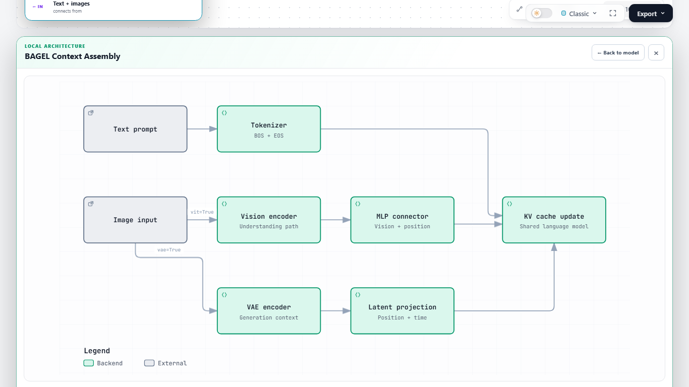

# Desktop child sizing

The child keeps the original inline expansion below the main architecture. Desktop sizing now accounts for both the available width and the viewport height. It preserves the authored SVG aspect ratio and a primary label floor of 10 CSS pixels. A taller graph still uses page scrolling when it cannot fit at that reading size. Narrow screens retain scrolling inside the graph stage.

The BAGEL context example has closer spacing between its three rows. Its components, connections and source links are unchanged. The parent diagram is unchanged.

All three examples and their five children were checked in real Chrome at 1920 × 1080, 1366 × 768 and 1280 × 720. Every complete child SVG was visible after opening it. Selecting a component kept the graph size stable. Returning restored the page position and parent selection.

| Viewport | BAGEL context primary labels |
| --- | --- |
| 1920 × 1080 | 16.8 CSS pixels |
| 1366 × 768 | 13.2 CSS pixels |
| 1280 × 720 | 12.1 CSS pixels |

[The receipt](receipt.json) records all 15 checks against source commit `41798f5f6aab5c3b8e0b8dbf5ac5942b7939a503`. This revision combines the desktop sizing correction and the maintainer's review fixes. Screenshots show the whole context graph without a child selection.

The browser regression also resizes the open context view between desktop sizes. A separate tall fixture verifies readable labels, page scrolling and the sticky return control. The existing real-download regressions cover independent main and child exports and parent selection through an actual SVG download and return.
